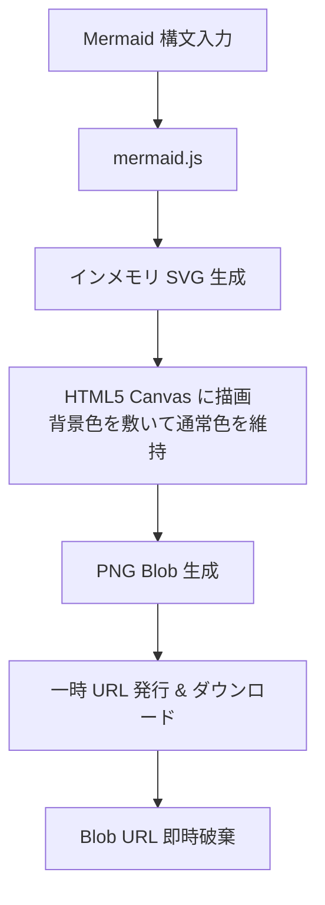

127.0.0.1 - - [22/Sep/2026 08:55:06] "GET / HTTP/1.1" 200 -
127.0.0.1 - - [22/Sep/2026 08:58:59] "GET / HTTP/1.1" 200 -
^Z
[1]+  Stopped                 python3 -m http.server
sakura@sakura:~/git/webmermaid$
sakura@sakura:~/git/webmermaid$
sakura@sakura:~/git/webmermaid$
sakura@sakura:~/git/webmermaid$
sakura@sakura:~/git/webmermaid$
sakura@sakura:~/git/webmermaid$
sakura@sakura:~/git/webmermaid$ cat readme.md
cat: readme.md: No such file or directory
sakura@sakura:~/git/webmermaid$ ls
index.html  README.md
sakura@sakura:~/git/webmermaid$ cat README.md
# Mermaid to PNG Converter

Mermaid 構文のダイアグラムをブラウザ上でレンダリングし、PNG 形式でダウンロードできる
GitHub Pages などの静的ホスティング環境で、サーバー通信を行わずに完全クライアントサ

---

## 主な特徴

- **完全ゼロデータ保持（Zero Data Retention）**
  バックエンドサーバー、データベース、外部トラッキング、ブラウザ内永続化（LocalStor
- **タブ切り替え式 UI（スマートフォン対応）**
  「入力（Terminal）」と「プレビュー」をタブで切り替えることで、狭い画面のスマートフ
- **ターミナル風エディタ & 視認性の高いプレビュー**
  - **全体 / 入力部**: 目に優しいダークテーマを基調とし、macOS / Linux ターミナル風
  - **プレビュー部**: ダイアグラム本来の可読性を保つため、標準の明るいキャンバス上で
- **高解像度エクスポート対応**
  Canvas ラスタライズ時の解像度倍率（1x / 2x / 3x）を選択可能。滲みのないシャープな
- **状態の初期化**
  誤操作防止の確認ダイアログ付き「初期化」ボタンにより、ワンクリックで初期サンプル状

---

## 画面構成 & 操作仕様

| 機能 | 説明 |
| :--- | :--- |
| **入力タブ (Terminal)** | 等幅フォントで Mermaid 構文を記述。構文エラー時は下部に
| **プレビュータブ** | レンダリングされた SVG を表示。スクロール（横・縦）に対応し、
| **解像度選択** | `1x`、`2x` (推奨)、`3x` (高画質) から書き出しスケールを指定。 |
| **初期化ボタン** | エディタ、プレビュー、各種設定を初期サンプル状態にリセット。 |
| **PNG保存ボタン** | 現在プレビューされている図表を `mermaid-{timestamp}.png` とし

---

## アーキテクチャ

### 処理フロー



---

## セキュリティ & プライバシー設計

| 項目 | 本ツールの仕様 |
| :--- | :--- |
| **外部通信** | 初回ロード時の CDN（Mermaid.js）取得のみ。入力データや画像は一切外
| **データ保持** | ローカルストレージ、Cookie、キャッシュ API へのコード保存なし。タ
| **メモリ管理** | 画像生成時に作成した Blob URL は、ダウンロード処理完了直後に `UR

---

## ファイル構成

リポジトリ直下に `index.html` ひとつを配置するだけで動作します。

```text
.
├── .gitignore   # Git 除外設定
├── index.html   # HTML, CSS, JavaScript を集約した単一ファイル
└── README.md    # 本ドキュメント
```

---

## 公開・デプロイ手順

### GitHub Pages で公開する場合

1. 本リポジトリをクローンまたは新規作成します。
2. 直下に `index.html` を配置し、GitHub へプッシュします。
3. リポジトリの **Settings** > **Pages** を開きます。
4. **Build and deployment** の **Source** で `Deploy from a branch` を選択します。
5. **Branch** に `main`（または `master`）の `/ (root)` を選択し、**Save** をクリックします。
6. 数分後に発行される URL にアクセスすれば利用可能です。

### ローカルで実行する場合

ビルドツールや Web サーバーは不要です。

```bash
git clone https://github.com/<your-username>/<repo-name>.git
cd <repo-name>
# ファイルをブラウザで直接開く
open index.html
```

---

## 技術スタック

- **Markup & Style**: HTML5, CSS3 (Vanilla CSS, CSS Variables)
- **Script**: Vanilla JavaScript (ES6+)
- **Parser & Renderer**: Mermaid.js v10 (CDN 経由)
- **Rasterizer**: HTML5 Canvas API
- **Export Format**: PNG (`image/png`)

---

## ライセンス

MIT License
